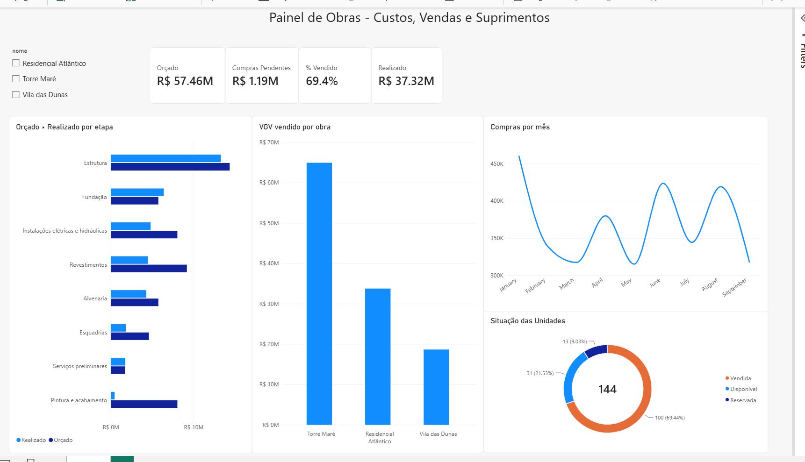

# Painel de Obras

Mini-sistema de gestão de obras de uma construtora **fictícia** do Litoral Norte gaúcho, feito para praticar o dia a dia de TI de uma incorporadora: API REST, Power BI, automação low-code, segurança e backup.



## O que tem aqui

| Parte | Tecnologia | O que faz |
|---|---|---|
| API REST | Node.js + Express | Obras, orçamentos por etapa, pedidos de compra, unidades e contratos de venda. Os recursos seguem os nomes das [APIs públicas do Sienge](https://api.sienge.com.br/docs/), com dados fictícios e formato simplificado |
| Dashboard | Power BI Desktop | Modelo estrela (Obras como dimensão), medidas DAX para orçado × realizado, % vendido, VGV e compras pendentes, com filtro por obra |
| Automação | Power Automate Desktop | Checa se a API está no ar, baixa o resumo das obras em CSV, salva o relatório do dia, roda o backup e avisa em caso de erro |
| Backup | PowerShell | Regra 3-2-1: zip com data/hora, hash SHA-256, cópia verificada em segundo destino, rotação das cópias antigas e script de restauração |

## Segurança da API

- Autenticação por chave (`x-api-key`) comparada em tempo constante
- Chave guardada em `.env`, fora do Git
- Limite de 120 requisições por minuto por IP
- Validação dos dados de entrada e limite de tamanho do corpo
- Servidor escutando só em `127.0.0.1`
- Gravação atômica do banco (arquivo temporário + renomear)

## Como rodar

```bash
npm install
node scripts/gerar-dados.js   # gera data/db.json com dados fictícios
cp .env.example .env          # e troque a API_KEY por uma chave longa
npm start                     # http://localhost:3000
npm test                      # 7 testes automatizados
```

### Rotas

| Método | Rota | Descrição |
|---|---|---|
| GET | `/api/saude` | Verifica se a API está no ar (sem chave) |
| GET | `/api/obras` · `/api/obras/:id` | Obras |
| GET | `/api/orcamentos?obraId=` | Orçamento por etapa (orçado, realizado, % concluído) |
| GET | `/api/pedidos-compra?obraId=&status=` | Pedidos de compra |
| POST | `/api/pedidos-compra` | Cria pedido (validado) |
| PATCH | `/api/pedidos-compra/:id/status` | Aprova, entrega ou cancela pedido |
| GET | `/api/unidades?obraId=&status=` | Unidades (vendida, reservada, disponível) |
| GET | `/api/contratos-venda?obraId=` | Contratos de venda (correção INCC) |
| GET | `/api/relatorios/resumo-obras[?formato=csv]` | Resumo consolidado por obra, em JSON ou CSV para Excel |

Exemplo:

```bash
curl -H "x-api-key: SUA_CHAVE" http://localhost:3000/api/relatorios/resumo-obras
```

### Backup

```powershell
# backup local + cópia verificada em outro destino (pendrive, Drive, OneDrive...)
powershell -ExecutionPolicy Bypass -File scripts\backup.ps1 -DestinoExterno "D:\Backups"

# restaurar
powershell -ExecutionPolicy Bypass -File scripts\restaurar.ps1 -Arquivo backups\db_AAAA-MM-DD_HHMMSS.zip
```

## Power BI

Os dados vêm da API via Power Query (`Web.Contents` com o cabeçalho da chave). Com a API rodando, basta clicar em **Atualizar**. O arquivo `.pbix` não fica no repositório porque as consultas guardam a chave da API.

Exemplo de consulta (Power Query M):

```
let
    Fonte = Json.Document(Web.Contents("http://localhost:3000/api/obras", [Headers=[#"x-api-key"="SUA_CHAVE"]])),
    Tabela = Table.FromRecords(Fonte)
in
    Tabela
```

Medidas DAX principais:

```
Orçado = SUM('Orçamentos'[orcado])
Realizado = SUM('Orçamentos'[realizado])
% Vendido = DIVIDE([Unidades Vendidas], COUNTROWS(Unidades))
Compras Pendentes = CALCULATE(SUM(Pedidos[valorTotal]), Pedidos[status] = "Pendente")
```

## Power Automate Desktop

Fluxo **Relatorio Diario Obras**:

1. Guarda a chave da API numa variável
2. Chama `/api/saude`. Se falhar, mostra o erro e para o fluxo
3. Baixa `/api/relatorios/resumo-obras?formato=csv`
4. Salva `relatorios/resumo_AAAA-MM-DD.csv`
5. Roda `scripts/backup.ps1` com cópia externa
6. Mostra o resumo do que foi feito

---

Desenvolvido por Ramires Rodrigues com apoio do Claude Code.
